

# Zoo Management API & TEST (PYTEST)

## API Endpoints

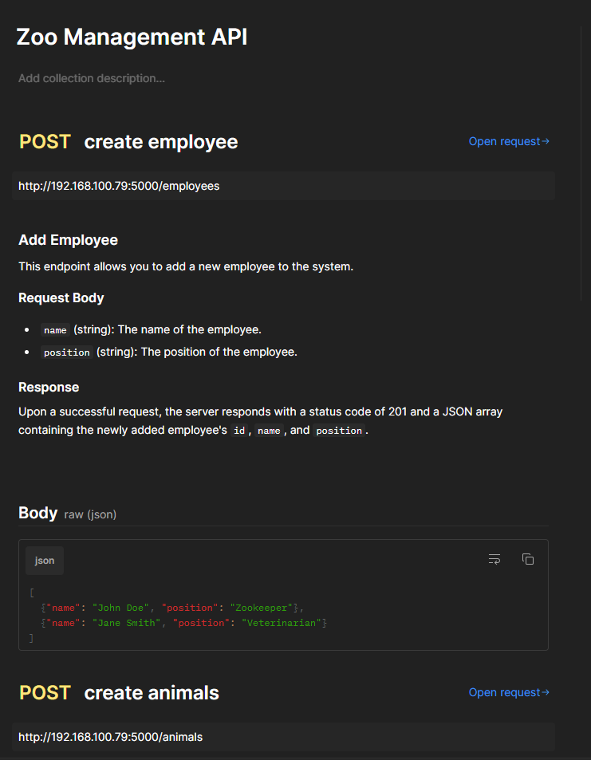
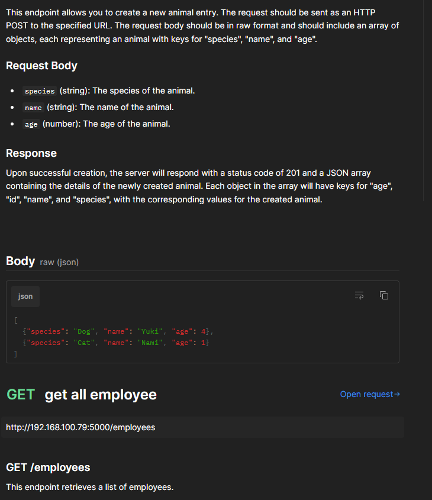
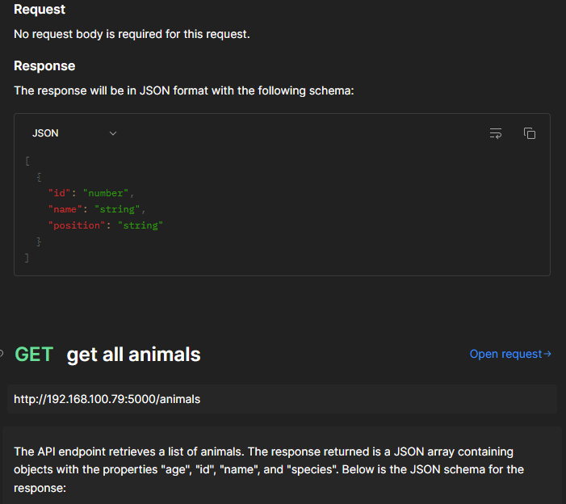
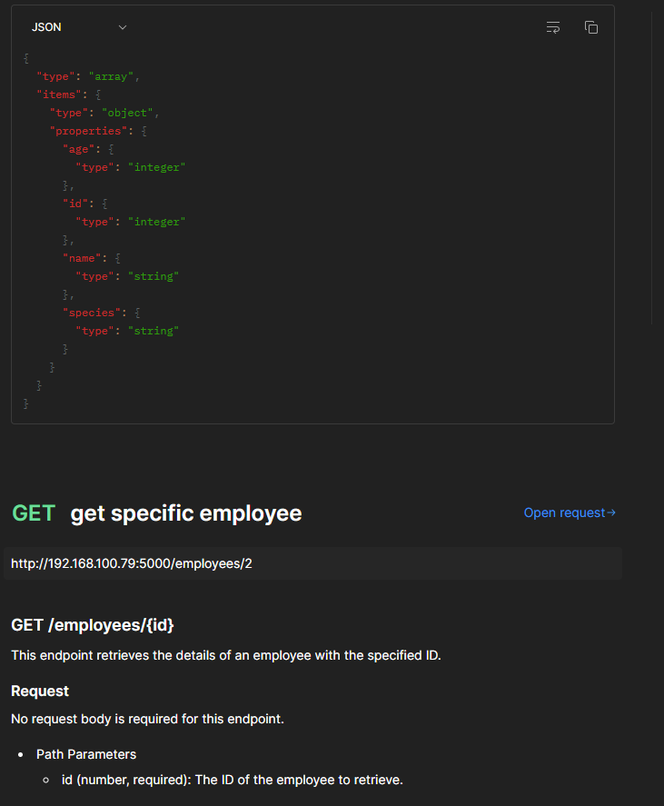
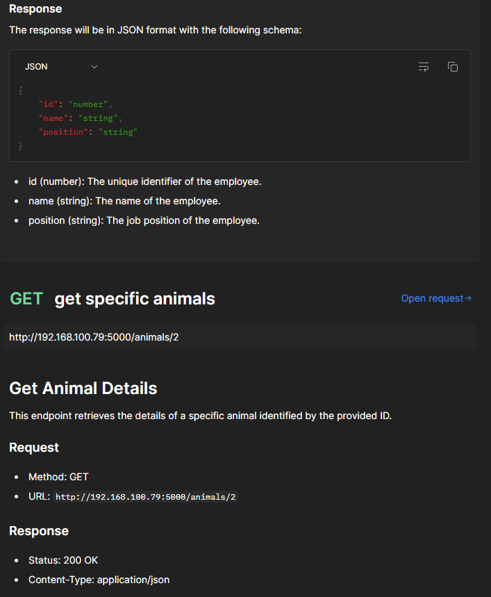
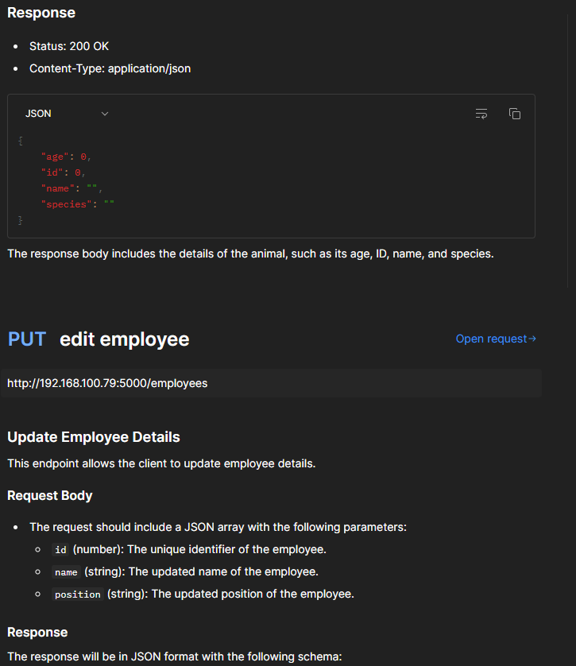
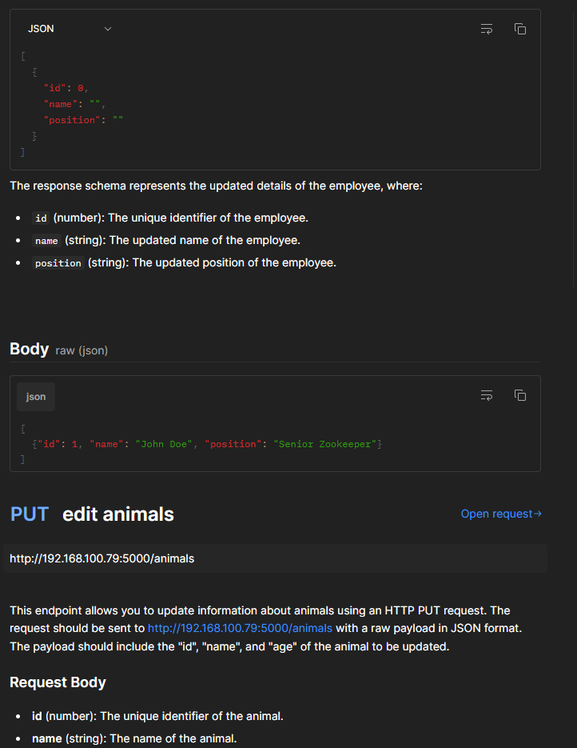
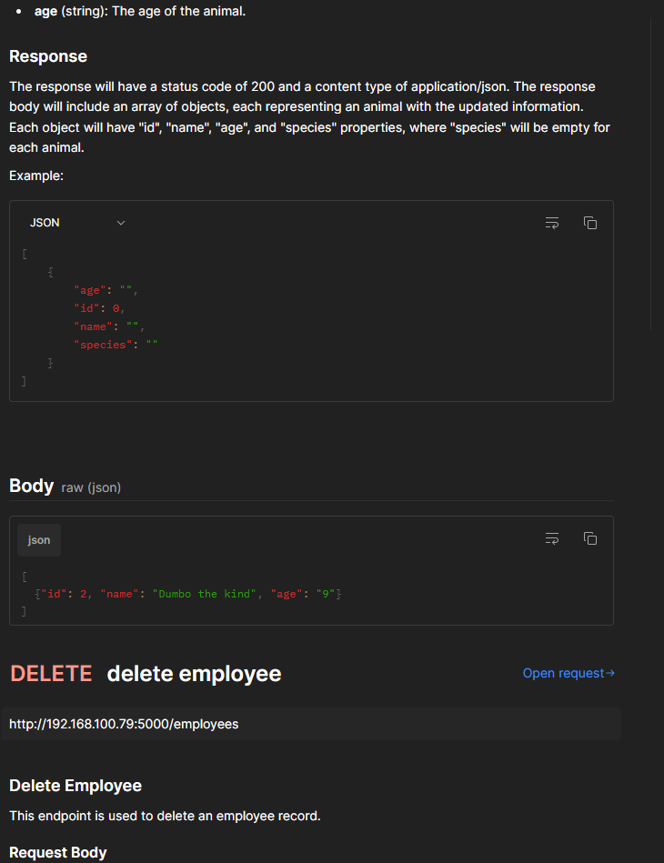
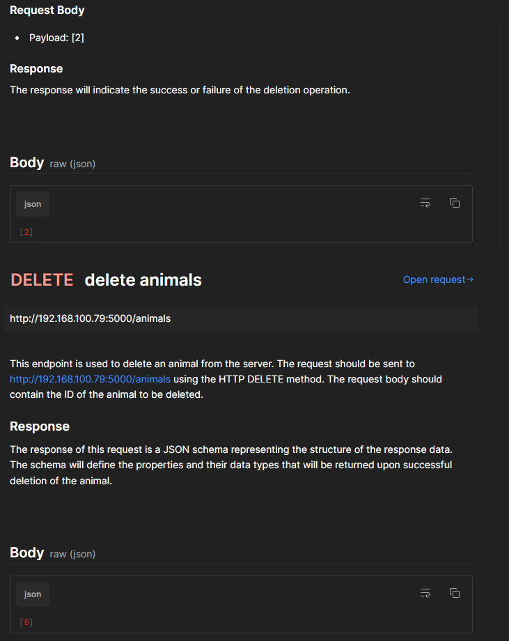

# TEST API
## with Poetry add Pytest

## example test
poetry add pytest > run pytest
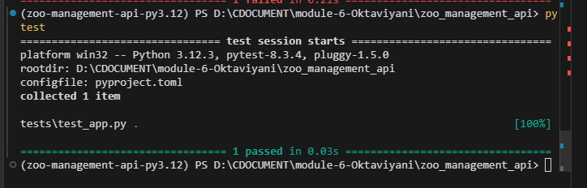
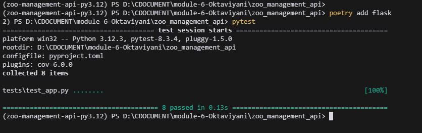

## code coverage
poetry add pytest-cov
pytest --cov=app
pytest --cov=app --cov-report=html

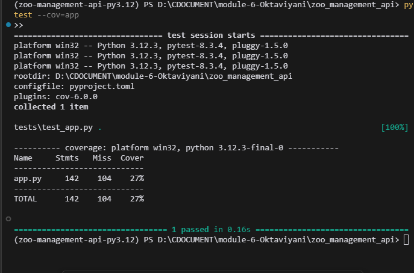
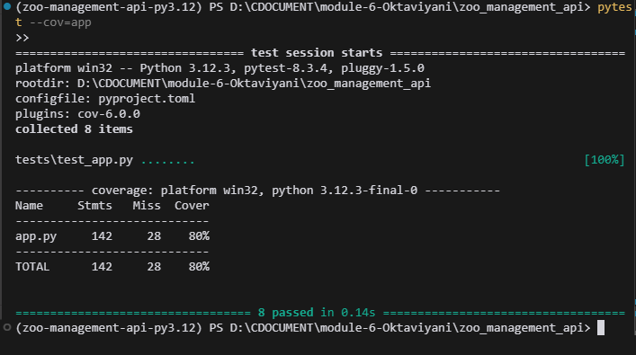
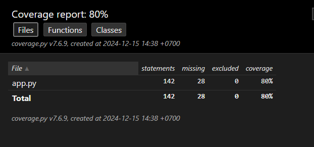